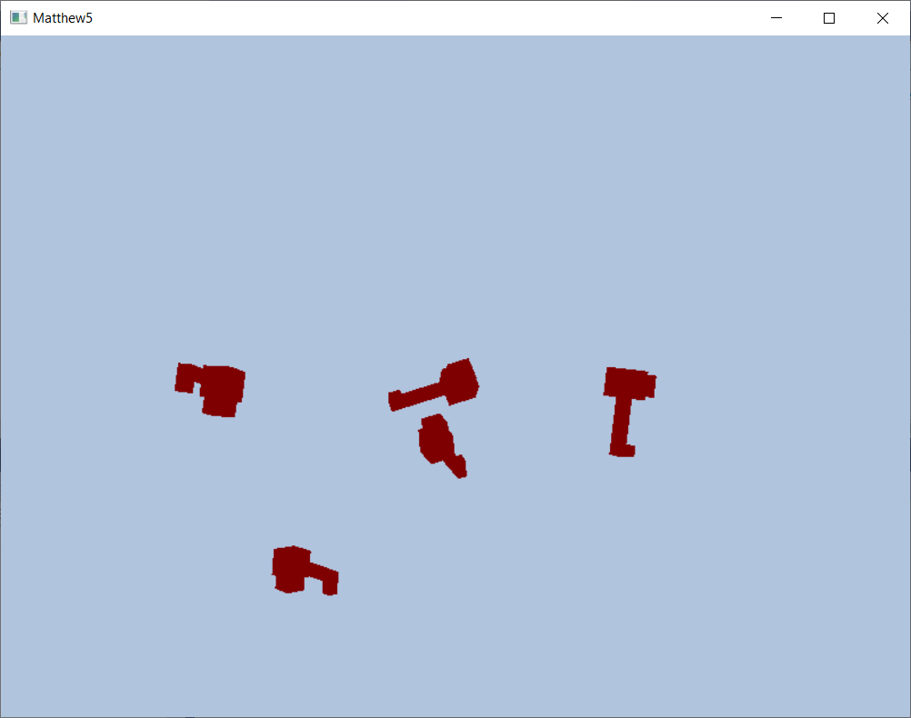

<h4>Matthew5 Project 4.000 Toy Engines</h4> 
Davant Stewart 

<h3>Ver 4.000 IN-PROGRESS, not completed</h3> 

 
 
The project is named after Matthew 5; I've always liked these verses. 
 Jesus when up on a mountain and sat down, he disciples came to him and 
 he began to teach them saying 
 Blessed are the poor in spirit, for theirs is the kingdom of heaven. 
 Blessed are those who mourn, for they will be comforted. 
 Blessed are the meek, for they will inherit the earth. 
 Blessed are those who hunger and thirst for righteousness, for they will be filled. 
 Blessed are the merciful, for they will be shown mercy. 
 Blessed are the pure in heart, for they will see God. 
 Blessed are the peacemakers,	for they will be called children of God. 
 Blessed are those who are persecuted because of righteousness, for theirs is the kingdom of heaven. 
                                                                                                     
 

This set of components is designed to keep graphics abstracted from the application, physics, networking, etc. 

 
See the "Notes.txt" document.
	The "Notes.txt" document gives step by step instructions of how to code from version 3.000 to 4.000.
	 

Goals: 
	Standard C++ where possible. 
	Current engines are tightly coupled, keep this toy engine loosely coupled.  
		Meaning, keep the following in separate libraries:  			
			Graphics 
			Windows & Keyboard Input 
			Physics (Plan to use Bullet Physics) 
			Audio  
			Networking 
                       
	Help Students Learn Advanced C++ using DirectX12. 
	DirectX12 is complicated. Matthew5 version 1.000 creates all the basic components to get DirectX 12 up 
	and running and output one Triangle to the screen. It supports both desktop and Oculus Rift. 
	Version 2.000 add the ability to add multiple scene objects, however, each scene object only has 
	a single triangle. Version 2 also add "Frame Resources" to keep the Gpu busy.
	Version 3.000 added geometry beyond a simple triangle. It also added support to placing data in 
	the "Gpu Default Buffer" which is more efficient for data that does not change.
	
	This is version 4.000. 
		Requirements and Ideas
		
			The client will be able to add different custom geometry using .obj files.
			
			Add Physics engine "Bullet" to the client code to make things move around somewhat. 
			The only rigid body is sphere so the "elephant boxes" roll.
			No bullet data types are in Matthew5Graphics; again, the point is to only 
			do graphics in the Matthew5Graphics API. This give the client flexibility and control.
			
			Maybe go down the Ray Tracing path a bit....

			
		
	 
	Each new version will add a small amount of functionality to keep learning easier. 

	This repository will not be updated to add new functionality.
	It will stay Version 4.000 unless there is a bug fix.  
	This allows students to easily get the version they need. 
                                                                                  
	You can use Blender to create some geometry and then export to obj format. 

 

UPDATE document below to 4.000 ...
The documentation below has not been updated for version 4.0.

 
 
 
 
 
 
 
 

 	
Matthew5Graphics lib 
	Version 3.000 
	
	The Matthew5Graphics class derives from the IMatthew5Graphics abstract class.
	The IMatthew5Graphics class now has 2 functions.  
	One method/function, is Draw(..). 
	The Draw method takes one parameter, IMatthew5DrawInstructions, which for this version only 
	contains the camera position.   
	The second function is AddSceneObject(..). This takes a parameter of type M5SceneObjectCpuPosition.
	This indicates where the scene object should be place. The client can call this function 
	as many times as they wish to add scene objects. For this version, each scene object is 
	an odd shaped box called "Elephant".
	
	To construct a Matthew5Graphics object the client only needs to supply a Windows HWND.
	This supports Desktop graphics; however, base classes can be overridden to support other graphics 
	platforms. See below in a seperate library for the Oculus implementation that uses this library.
	
	High level overview of components 
		Matthew5Dx : IMatthew5Graphics
			This will be derived from to support Desktop or Oculus. Both Desktop and Oculus 
			use the same Root Signature, Shaders and PSO provided by this base class.
			Interface:
				Matthew5Dx(HWND vHWND);
				virtual void Draw(IMatthew5DrawInstructions & vrIMatthew5DrawInstructions) = 0;
				virtual std::int32_t AddSceneObject(M5SceneObjectCpuPosition vM5SceneObjectCpuPosition) = 0;

			Contains:
				M5DxGpuDeviceNFactory 	
				M5DxGpuCommand				
				M5DxGpuSwapChain				
				Root Signature 
				Shaders
				PSO
				Frame Resources
				...
	
		M5DxGpuDeviceNFactory 
			Interface:
				IDXGIFactory4 & GetIDXGIFactory4(void);
				ID3D12Device & GetID3D12Device(void);
				HWND GetHWND(void);
				...
		
		M5DxGpuCommand
			This supports N number of command lists and one command queue.
			Interface:
				ID3D12CommandQueue & GetCommandQueue(void);
				ID3D12CommandAllocator & GetCommandAllocator(int vIndex);
				ID3D12GraphicsCommandList & GetCommandList(int vIndex);
				void EmptyCommandQueueUsingFence(void);

		IMatthew5SwapChain
			Interface:
				This is very thin and will be derived from for either Desktop or Oculus.				

		M5SceneObject 
			Interface:
				M5SceneObject(ID3D12Device & vrpID3D12Device);
				D3D12_GPU_VIRTUAL_ADDRESS GetGpuConstBufferAddressThatHasWorldSpaceNMoreData(void);
				M5TriCpuGpuResources & GetM5TriCpuGpuResources(void);
				void SetM5TriCpuGpuResources(std::unique_ptr<M5TriCpuGpuResources> vpM5TriCpuGpuResources);
				void UpdatePosition(M5SceneObjectCpuPosition vM5SceneObjectCpuPosition);					
			Contains:
				M5TriCpuGpuResources
				M5SceneObjectCpuAndGpuPosition
				
		M5DxFrameResources
			Interface:
				M5ViewProjectionCpuAndGpu & GetM5ViewProjectionCpuAndGpu(void);
				M5DxFrameSceneObjectList & GetSceneObjectList(void);
				void SetTheFence(void);
				void WaitForFence(void);
			Contains:
				This keeps all the scene objects for a given frame.
				This keeps all the camera positions for a given frame.
				
		Miscellaneous Components used by both Desktop and Oculus
			Matthew5DxDescriptorHeapManager
			M5ViewProjectionCpuAndGpu
			M5DxGpuMemoryUploadBuffer
			...

 
	High level overview of Desktop components 

		Matthew5DxDesktop : public Matthew5Dx
			This implements desktop specific code.
			
		Matthew5DxDesktopSwapChain : IMatthew5SwapChain
			This provides swap chain functionality specific to Desktop.

 
 
Matthew5GraphicsOculus  
	Version 3.000 
	This provides an Oculus implementation of the Matthew5Graphics::IMatthew5Graphics interface.
	This provides the same functionality as the Desktop, but with the Oculus Rift.
	Like the desktop version, this outputs one Elephant box for each scene object added. 
	The Oculus implementation has some extra complexities because the HMD moves and requires 
	two render processes per frame, one for each eye.
	The Matthew5DxOculus class derives from Matthew5Dx which derives from IMatthew5Graphics.
	This uses the same Shaders, Root Signature, PSO and so on that are used by the Desktop.
	To reduce code, there is no mirror support so the desktop window will not have anything showing, 
	only the Oculus Rift will show the triangles.
	
	High level overview of components 
		Matthew5DxOculus : public Matthew5Dx
			This implements Oculus specific code.

		Matthew5DxOculusSwapChain : IMatthew5SwapChain
			This provides swap chain functionality specific to Oculus.

 
 

Matthew5Windows lib  
	Version 1.000  
	Keep Windows and user input as separate from the Graphics as much as possible.
	This creates a window and provide the HWND to the client.  
	This provides a simple API to the client for getting user keyboard and mouse actions. 	

	High level overview of components
		Matthew5Windows
			Interface:
				Matthew5Windows(HINSTANCE vHINSTANCE, int vWindowWidth, int vWindowHeight);
				Matthew5WindowsUserHoldingKeys & GetWindowsMessages(void);
				HWND GetHWND(void);
		Matthew5WindowsUserHoldingKeys - struct
			public Properties/interface:
				bool CharHit(char c);
				bool UpArrow, LeftArrow, DownArrow, RightArrow;
				bool Control, Escape,SpaceBar, Shift, Tab;			
				bool CloseProgram = false;
				bool MouseLeft, MouseMiddle, MouseRight;
				int  MouseClickX, MouseClickY;
				int MouseCurrentX;
				int MouseCurrentY;
				int MouseClickAndHoldMoveX, MouseClickAndHoldMoveY;
				int GetMouseMoveX(void); 	
				int GetMouseMoveY(void)
					
 
 

Matthew5 exe  
	Version 3.000  
	This uses Matthew5Windows to create a basic window and to get user keyboard input.
	Next, this creates a IMatthew5Graphics interface, a pointer. If Oculus is it will be pointing to 
	an instance of Matthew5DxOculus, if not then it will be pointing to Matthew5DxDesktop.
	However, the "exe" client code in main only uses the IMatthew5Graphics functions, nothing from 
	derived classes.
	Four scene objects are added at different locations; each scene object is the odd shaped "Elephant" box.
	Last, this takes user input from the W or S keys to update the camera position.
	Last last, this calls IMatthew5Graphics::Draw(..) over and over, passing the camera position.
	
	Note there is no timing logic in this simple example so the Desktop version moves the camera much 
	faster that the Oculus version because the Desktop has a mush faster frame rate.
	

 
 
Licensed - See LICENSE.txt
 

Licensed - The file OculusEyeTexture.h in the Matthew5GraphicsOculus project is mostly from the TinyRoom example. License information is at the top of the file and is an Apache license: http://www.apache.org/licenses/LICENSE-2.0
 
Licensed - "tinyobjloader" Used to load geometry in obj format. See License information in the tinyobjloader directory.
 
Licensed - "Bullet Physics" See License information in the LibBulletPhysics directory.
 
 
Screen shot of Matthew5 version 4.000 Desktop 

   
Screen shot of Matthew5 version 3.000 Oculus 

 

History

Bought from Amazon "3D Game Programming with DirectX 12" by Frank Luna. 
	Good book. I didn't read all of it but it was very helpful. This book does not have any Oculus information but covers DirectX12. 
Read many pages from Microsoft's DirectX 12 Programming Guide
	https://docs.microsoft.com/en-us/windows/desktop/direct3d12/directx-12-programming-guide   
Reviewed Oculus Rift DirectX developer Examples. 
Reviewed many help sites, blogs, examples, etc...

	
